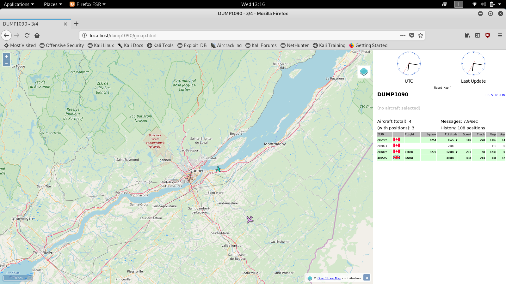
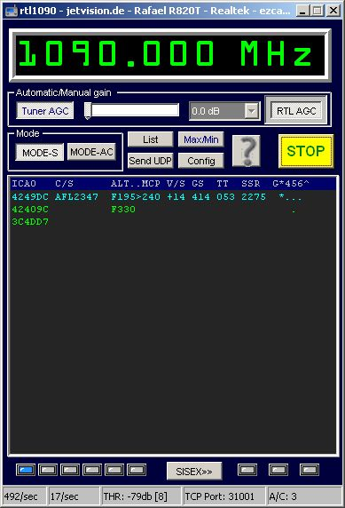

# Écoute de transpondeurs d'avion
**Note: Les instructions des exercices sont faites pour le logiciel GQRX et Linux. Cependant, les mêmes principes s'appliquent pour les autres logiciels d'écoute de signaux**

Les signaux [ADS-B](https://en.wikipedia.org/wiki/Automatic_dependent_surveillance_%E2%80%93_broadcast) sont des signaux utilisés par les avions afin de communiquer à leur tour de contrôle et aux autres avions leur position, vitesse et altitude. Il s'agit d'un signal pouvant être capté à la fréquence 1090 Mhz n'importe-où dans le monde.

L'écoute de signaux [ADS-B](https://en.wikipedia.org/wiki/Automatic_dependent_surveillance_%E2%80%93_broadcast) a été popularisée par (l'un peu étrange) passe-temps du _planespotting_, qui consiste à identifier le plus d'avions possibles passant au-dessus de nos têtes.

Sur **Kali Linux**, la manière la plus facile de procéder est d'installer le package `dump1090-mutability`:

```
# apt-get install dump1090-mutability
```

Il ne s'agit pas de la version la plus récente du populaire `dump1090`, mais sur **Kali** j'ai trouvé que c'était celle qui fonctionnait le plus facilement. Pour une version plus à jour, [FlightAware](https://github.com/flightaware/dump1090) en maintient une encore à ce jour.

Une fois le logiciel installé, vous pouvez directement le lancer et si un avion est dans les parages (dans le cadre de ce workshop, il y a de bonnes chances car l'aéroport de Québec n'est pas très loin...) vous devriez commencer à voir ce type de message entrer:

```
# dump1090-mutability
...
*8dc07f3d580f06a95a2a37046e16;
CRC: 000000
RSSI: -16.5 dBFS
Score: 1800
Time: 64072988.17us
DF:17 AA:C07F3D CA:5 ME:580F06A95A2A37
 Extended Squitter Airborne position (barometric altitude) (11)
  ICAO Address:  C07F3D (Mode S / ADS-B)
  Air/Ground:    airborne
  Altitude:      1800 ft barometric
  CPR type:      Airborne
  CPR odd flag:  odd
  CPR NUCp/NIC:  7
  CPR latitude:  46.77182 (87213)
  CPR longitude: -71.25794 (10807)
  CPR decoding:  global
```
On peut ainsi décoder plusieurs informations à propos de ce vol: On sait qu'il est à 1800 pieds, à une latitude de 46.77 et une longitude de -71.25. L'addresse ICAO nous permettrait aussi d'identifier la compagnie aérienne et le trajet moyennant une petit recherche Google.

Il y a aussi une fonctionnalité intéressante qui vient avec `dump1090`: Il vient avec un petit serveur Web qui permet d'avoir un visuel sur les avions aperçus. Afin d'activer cette fonctionnalité, il faut d'abord installer activer certains modules `lighthttpd`:

```
# lighty-enable-mod dump1090
# mkdir /run/dump1090-mutability/
```

Il est possible de vérifier l'activation du module en vérifiant qu'il existe un fichier de ce type sur le système: `/etc/lighthttpd/conf-enabled/89-dump1090.conf`

```
# Allows access to the static files that provide the dump1090 map view,
# and also to the dynamically-generated json parts that contain aircraft
# data and are periodically written by the dump1090 daemon.

url.redirect += (
  "^/dump1090/$" => "/dump1090/gmap.html",
  "^/dump1090$" => "/dump1090/gmap.html"
)

alias.url += (
  "/dump1090/data/" => "/run/dump1090-mutability/",
  "/dump1090/" => "/usr/share/dump1090-mutability/html/"
)

# The stat cache must be disabled, as aircraft.json changes
# frequently and lighttpd's stat cache often ends up with the
# wrong content length.
server.stat-cache-engine    = "disable"
```

Il ne devrait maintenant que rester à redémarrer `dump1090-mutability` avec les options appropriées:

```
dump1090-mutability --write-json /run/dump1090-mutability/
```

Si tout va bien, vous devriez pouvoir naviguer sur `http://localhost/dump1090/gmap.html`



## Windows (_non testé_)
Sur Windows, il existe plusieurs logiciels d'écoute ADS-B. Assurez-vous d'avoir bien installé les pilotes RTLSDR; Ensuite, un exemple qui semble populaire est [RTL1090](https://rtl1090.com/).



Bonne expérience!

## Sommaire
1. [**Préparation:**](installation.md) Installation d'un logiciel de SDR
2. [**Premier exercice:**](FM.md) Écoute d'une station FM
3. [**Deuxième exercice:**](ADS-B.md) Décodage de signaux ADS-B (Avions)
4. [**Troisième exercice:**](POCSAG.md) Décodage de signaux FLEX (Pagette)
