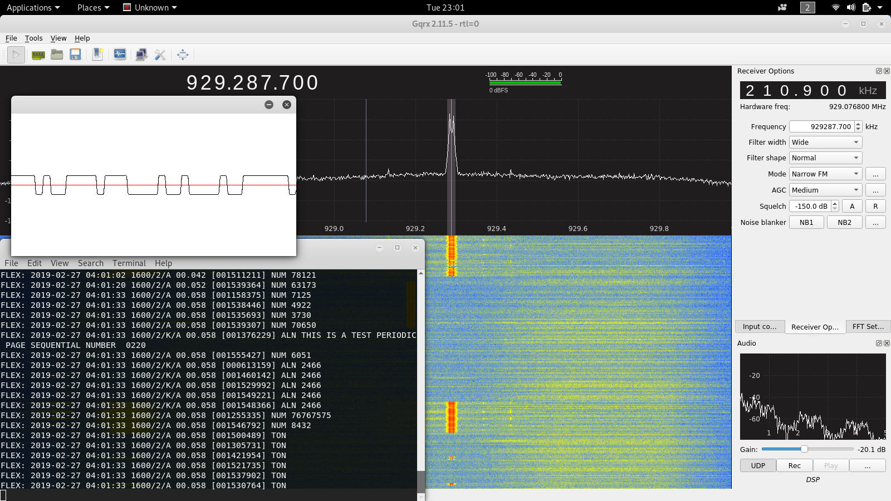
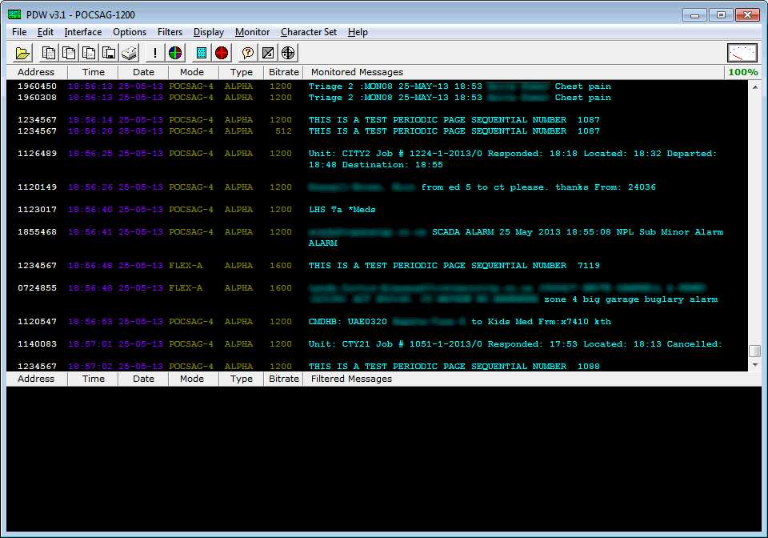

# Écoute de pagettes POCSAG/FLEX
**Note: Les instructions des exercices sont faites pour le logiciel GQRX et Linux. Cependant, les mêmes principes s'appliquent pour les autres logiciels d'écoute de signaux**

Les pagettes sont encore utilisées de nos jours par divers professionnels, que ce soit du personnel médical pour être informé de certaines urgences, ou encore des systèmes informatiques qui doivent contacter des gens "de garde". J'ai même vu à quelques occasions passer des erreurs SQL sur ce canal de communication non-chiffré.

Au Canada, le protocole utilisé est FLEX, une variante du plus répandu POCSAG. Il y a plusieurs fréquences d'émission, mais j'ai trouvé que la plus vocale était `929.3 Mhz`. Afin de commencer à écouter du FLEX, démarrez GQRX avec ces paramètres:

- **Fréquence:** <929.3 or autre...>
- **Filter Width:** Wide
- **Filter Shape:** Normal
- **Mode:** Narrow FM

Il faudra aussi installer deux autres packages afin de mener à bien notre expérience, `sox` et `multimon-ng`:

```
# apt-get install sox multimon-ng
```

Finalement activez le streaming du son en UDP dans GQRX en appuyant sur le bouton `UDP` en bas à droite et dans un nouveau terminal, exécutez la commande suivante:

```
nc -l -u -p 7355 |
sox -r 48000 -t raw -b 16 -c 1 -e signed-integer /dev/stdin -r 22050 -t raw -b 16 -c 1 -e signed-integer - |
multimon-ng -t raw -c -a POCSAG512 -a POCSAG1200 -a POCSAG2400 -a FLEX -a SCOPE -f alpha /dev/stdin
```

Notez que j'ai ici séparé les lignes pour la clarté, mais cette commande devrait être exécutée **toute sur la même ligne** pour qu'elles se _pipent_ (je n'ai pas trouvé de traduction satisfaisante) l'une après l'autre.

Ici:

- **nc** va ouvrir un _netcat_ et écouter les paquets audio envoyés par GQRX
- **sox** va transformer cet audio dans un format compréhensible pour le démodulateur
- **multimon-ng** va prendre ce résultat et démoduler l'audio afin d'en extraire des données en format _plain-text_.

Vous devriez obtenir quelque-chose comme ceci:



## Windows (_non testé_)
Sur Windows, il existe plusieurs logiciels d'écoute POCSAG. Assurez-vous d'avoir bien installé les pilotes RTLSDR; Ensuite, un exemple qui semble populaire est [PDW](https://www.discriminator.nl/pdw/index-en.html).



Un tutoriel détaillé est disponible sur [cette page](https://www.rtl-sdr.com/rtl-sdr-tutorial-pocsag-pager-decoding/).

Bonne expérience!

## Sommaire
1. [**Préparation:**](installation.md) Installation d'un logiciel de SDR
2. [**Premier exercice:**](FM.md) Écoute d'une station FM
3. [**Deuxième exercice:**](ADS-B.md) Décodage de signaux ADS-B (Avions)
4. [**Troisième exercice:**](POCSAG.md) Décodage de signaux FLEX (Pagette)
