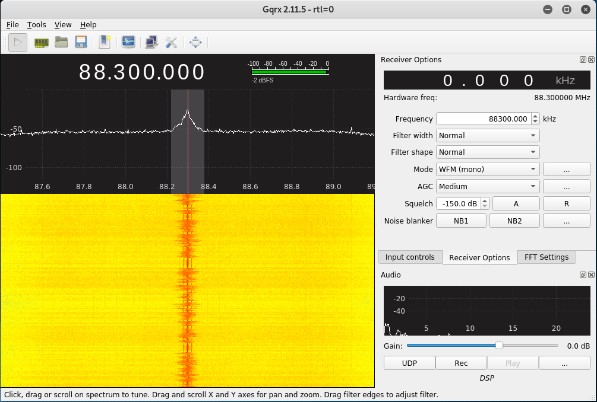
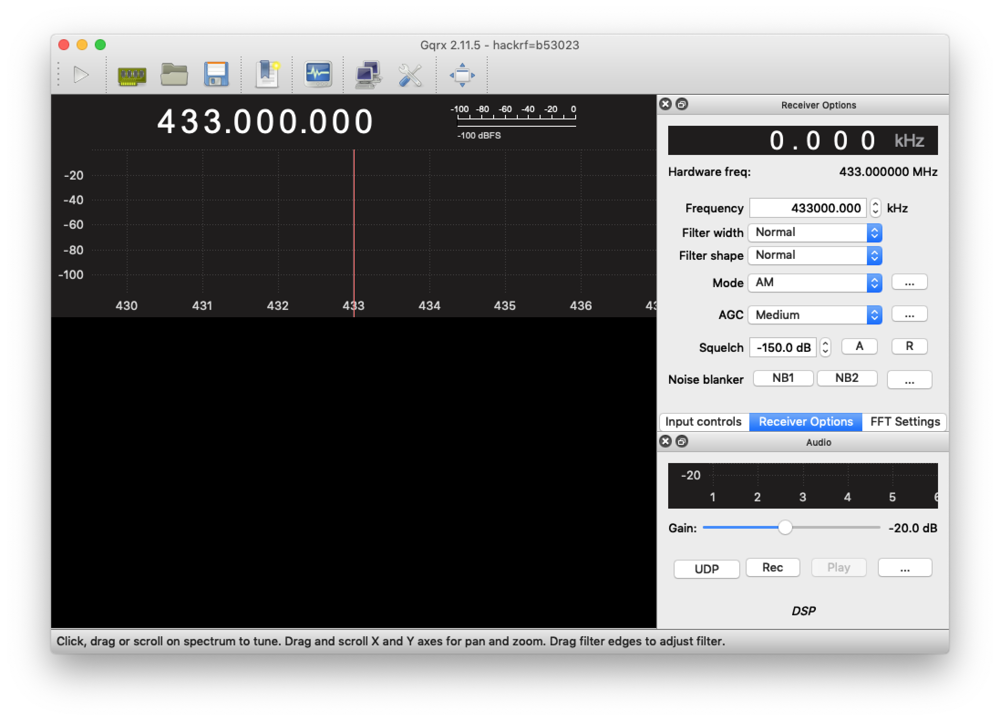
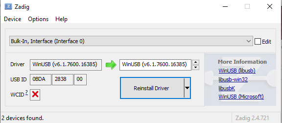
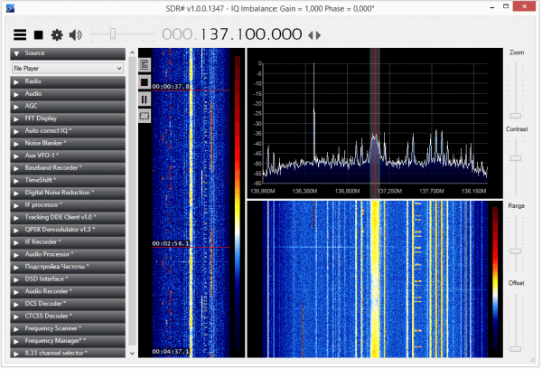

# Installation d'un logiciel de SDR
Pour cet atelier, le système d'exploitation de préférence est Linux; Ceci-dit, il est aussi possible de compléter ces exercices sous OSX ou Windows, je, ça ne fera qu'impliquer un peu plus de _Google-Fu_ :-)

## Linux
Le *go-to* software pour les SDR sur Linux est GQRX, mais d'abord, nous devons installer les *drivers*:

### Installation des drivers RTL-SDR
La procédure d'installation devrait être la même pour la plupart des *dongles* qui utilisent le *chipset* Realtek **RTL2838** (La plupart de ceux sur le marché qui coûtent moins de 50$).

Premièrement, vérifier que le *dongle* SDR est bien détecté:

```
$ sudo lsusb
Bus 004 Device 008: ID 0bda:2838 Realtek Semiconductor Corp. RTL2838 DVB-T
```

Good! Cependant, les *drivers* par défaut qui viennent avec **Debian/Ubuntu/Kali** ont été conçus pour être utilisés comme TV-Tuner, ce qui ne nous intéresse que peu. Il faut donc "blacklister" ce pilote afin qu'il ne charge pas au démarrage de l'ordinateur. Pour ce faire, il suffit de créer un fichier `/etc/modprobe.d/blacklist-dvb.conf` avec ceci comme contenu:

```
blacklist dvb_usb_rtl28xxu
```

Ensuite, redémarrer votre Debian/Kali par précaution, pour être certain que les pilotes inintéressants ne sont pas chargés. Vous pouvez vérifier que c'est le cas à l'aide de la commande suivante, qui ne devrait rien retourner:

```
# lsmod | grep -i dvb
#
```

Maintenant que l'installation est "propre", il est temps d'installer les pilotes appropriés:

```
sudo apt-get install rtl-sdr
```

Parfait! À partir de ce moment, nous devrions avoir une unité SDR fonctionnelle. Pour tester, branchez le _dongle_ dans votre ordinateur. Une manière de vérifier que tout fonctionne est d'exécuter la commande `rtl_test` qui vient avec le _package_ que l'on vient d'installer. Laissez-la rouler quelques secondes pour confirmer que tout est correct:

```
$ rtl_test
Found 1 device(s):
 0: Realtek, RTL2838UHIDIR, SN: 00000001

Using device 0: Generic RTL2832U OEM
Found Rafael Micro R820T tuner
Supported gain values (29): 0.0 0.9 1.4 2.7 3.7 7.7 8.7 12.5 14.4 15.7 16.6 19.7 20.7 22.9 25.4 28.0 29.7 32.8 33.8 36.4 37.2 38.6 40.2 42.1 43.4 43.9 44.5 48.0 49.6 
[R82XX] PLL not locked!
Sampling at 2048000 S/s.

Info: This tool will continuously read from the device, and report if samples get lost. If you observe no further output, everything is fine.

Reading samples in async mode…
Allocating 15 zero-copy buffers
lost at least 96 bytes
^CSignal caught, exiting!

User cancel, exiting…
Samples per million lost (minimum): 0
```

### Installation de GQRX

Sur Debian/Kali, ce devrait être aussi simple que:

```
sudo apt-get install gqrx
```
Et... voilà:



## OSX

Sur OSX, il n'y a pas besoin d'installer de pilotes spéciaux. Il existe aussi un `brew cask` directement compatible avec le plus récent OSX. 

Premièrement, Il vous faudra installer [Homebrew](https://brew.sh/), un _package manager_ open source:

```
/usr/bin/ruby -e "$(curl -fsSL https://raw.githubusercontent.com/Homebrew/install/master/install)"
```
Puis, allez chercher le `cask` de `gqrx`:

```
brew cask install gqrx
```


## Windows

### SDR-Sharp

Sur Windows, vous pouvez installer **SDR#**; Il suffit de se rendre sur [la page de téléchargement](https://airspy.com/download/) et dé-zipper le fichier. Double-clickez sur le script `install-rtlsdr` pour installer les drivers.

**Pour les utilisateurs Windows 10:** Il existe un problème quelquonque avec les drivers qui viennent directement de AirSpy. La solution est de télécharger un logiciel nommé [Zadig](https://zadig.akeo.ie/) qui s'occuppera de télécharger le bon pilote et de l'installer.



Assurez-vous de choisir l'Interface 0 qui a comme pilote un débutant par "RTL2838U". Appuyez ensuite sur "Reinstall Driver".

Vous devriez maintenant être en mesure d'exécuter SDRSharp directement!



## Exercices
1. [**Premier exercice:**](exercices/FM.md) Écoute d'une station FM
2. [**Troisième exercice:**](exercices/ADS-B.md) Décodage de signaux ADS-B (Avions)
3. [**Deuxième exercice:**](exercices/POCSAG.md) Décodage de signaux FLEX (Pagette)